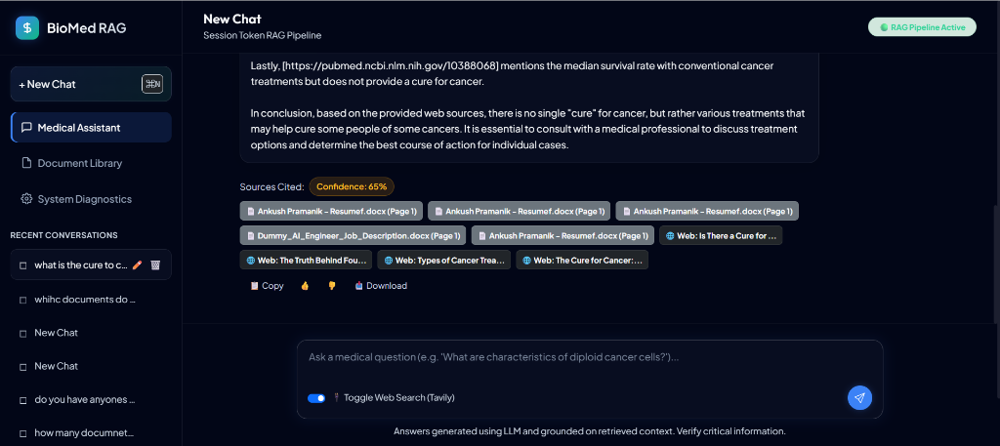
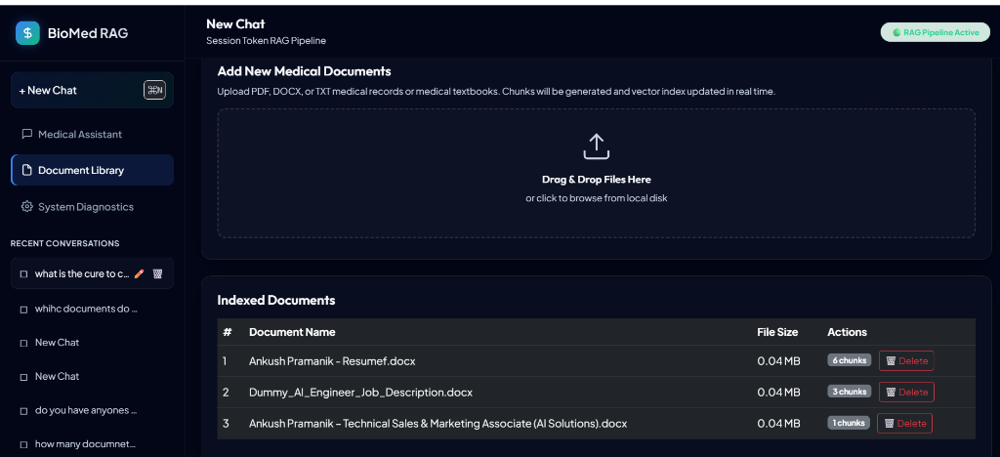
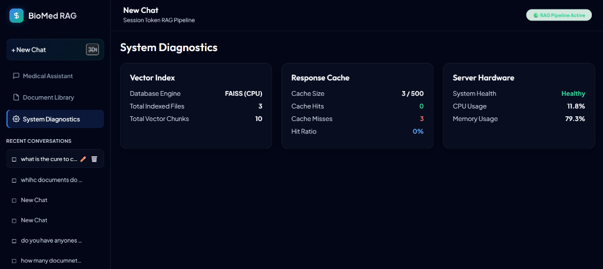

# Medical RAG SaaS Application

A professional, production-grade Medical Retrieval Augmented Generation (RAG) SaaS application featuring a premium dark-themed glassmorphism dashboard, hybrid search, streaming capabilities, file library management, and admin diagnostics.

## 🚀 Live Demo

**[https://biomed-rag-1.onrender.com](https://biomed-rag-1.onrender.com)**

> ⚠️ Hosted on Render free tier — may take **~50 seconds** to wake up on first visit.

---

## Screenshots

### 1. Medical Assistant Chat Feed


### 2. Document Library (Drag & Drop Ingestion)


### 3. System Diagnostics & Health Monitor


---

## Key Features

1. **UI/UX (Premium SaaS Dashboard):**
   - Premium glassmorphism UI with Outfit and Plus Jakarta Sans fonts.
   - ChatGPT-like chat interface with auto-scrolling and typing state skeletons.
   - Session/chat history tracking with renaming and deletion.
   - Dynamic file manager with Drag & Drop file ingestion.
   - Export responses to Markdown or download as clean local files.

2. **RAG & Retrieval Architecture:**
   - **Hybrid Retrieval:** Dense Vector search (FAISS + Cohere embeddings) merged with Sparse Keyword search (scikit-learn TF-IDF Vectorizer).
   - **Reciprocal Rank Fusion (RRF):** Merges dense and sparse search rankings using normalized RRF confidence scoring.
   - **Grounding checks:** Prompt constraints prevent hallucinations and return clear fallback messages when info is absent.
   - **Citations:** Source filename and document page numbers embedded directly into citation badges.

3. **Web Search Integration:**
   - Tavily Web Search API integration togglable via UI switch.
   - Merges local documents and live web search context seamlessly.

4. **Security & Performance:**
   - Sliding-window rate limiters per-IP (protects uploads and search endpoints).
   - Thread-safe, time-bounded in-memory Response Caching.
   - Lazy preloading of AI models to minimize FastAPI startup delays.
   - Input sanitization defending against prompt injection vectors.

5. **Observability & Diagnostics:**
   - Structured JSON logging.
   - `/admin/health` diagnostics displaying RAM/CPU usage, FAISS statistics, and cache performance.

---

## Tech Stack

- **Backend:** FastAPI, Uvicorn, LangChain, LangChain-Groq
- **Frontend:** Bootstrap 5.3.0, Vanilla JavaScript, HTML5, Custom Glassmorphism CSS
- **Vector DB:** FAISS (CPU)
- **Embeddings:** Cohere `embed-english-v3.0` (1024-dim, via REST API)
- **LLM Engine:** Groq Cloud API (Llama-3.3-70b-versatile)

---

## Installation & Setup

### Local Setup
1. **Clone the repository:**
   ```bash
   git clone <repo-url>
   cd Medical-RAG-using-Bio-Mistral-7B
   ```

2. **Install Python dependencies:**
   ```bash
   pip install -r requirements.txt
   ```

3. **Configure environment variables:**
   Create a `.env` file in the project root:
   ```env
   GROQ_API_KEY=your_groq_api_key
   COHERE_API_KEY=your_cohere_api_key      # Free at dashboard.cohere.com
   TAVILY_API_KEY=your_tavily_api_key      # Optional: for web search
   ```

4. **Run the server:**
   ```bash
   python -m uvicorn app:app --port 8001
   ```
   Open `http://127.0.0.1:8001` in your browser.

### Docker Deployment
You can build and deploy the containerized environment using Docker Compose:

1. **Verify your `.env` file** exists.
2. **Start the application:**
   ```bash
   docker-compose up -d --build
   ```
3. The server will spin up and run on `http://localhost:8001`. Data files and FAISS vector index are persistent through volumes.

---

## API Documentation

- `GET /` - Serves the web-based SaaS dashboard.
- `GET /chats` - Retrieve all recent chat sessions.
- `PUT /chats/{chat_id}` - Create or rename a conversation session.
- `DELETE /chats/{chat_id}` - Purge a conversation session.
- `POST /get_response` - Stream RAG responses in Server-Sent Events (SSE) format.
- `POST /upload` - Upload and index a file (PDF, DOCX, TXT).
- `GET /documents` - List all indexed documents.
- `DELETE /documents/{filename}` - Delete a document and purge it from the FAISS store.
- `GET /admin/health` - Health metrics and diagnostics statistics.
